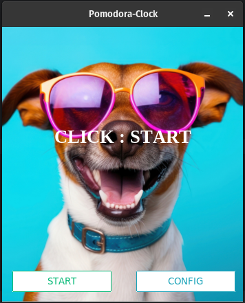

<a id="readme-top"></a>

<!-- PROJECT LOGO -->
<br />
<div align="center">
  <a href="https://www.rawpixel.com/image/12053935/image-background-dog-face">
    
  </a>

  <h3 align="center">Pomodora Clock</h3>

  <p align="center">
    A simple customizable pomodoro clock!
    <br />
    <a href="https://codeberg.org/Ryan-Goosen/pomodoraClock"><strong>Explore the docs »</strong></a>
    <br />
    <br />
  </p>
</div>

<!-- TABLE OF CONTENTS -->
<details>
  <summary>Table of Contents</summary>
  <ol>
    <li>
      <a href="#about-the-project">About The Project</a>
      <ul>
        <li><a href="#built-with">Built With</a></li>
      </ul>
    </li>
    <li>
      <a href="#getting-started">Getting Started</a>
      <ul>
        <li><a href="#prerequisites">Prerequisites</a></li>
        <li><a href="#installation">Installation</a></li>
      </ul>
    </li>
    <li><a href="#usage">Usage</a></li>
    <li><a href="#roadmap">Roadmap</a></li>
    <li><a href="#contributing">Contributing</a></li>
    <li><a href="#license">License</a></li>
    <li><a href="#contact">Contact</a></li>
    <li><a href="#acknowledgments">Acknowledgments</a></li>
  </ol>
</details>


<!-- ABOUT THE PROJECT -->
## About The Project

<div align="center">

![Product Name Screen Shot][product-screenshot]

</div>


I created this Pomodora-Clock to help me start working by creating small time commitments which helped me overcome the mountain that is a 2 hours study session.


<p align="right">(<a href="#readme-top">back to top</a>)</p>


### Built With

[![Python][Python]][Python]

<p align="right">(<a href="#readme-top">back to top</a>)</p>


<!-- GETTING STARTED -->
## Getting Started

These instructions cover both the running of the packaged version and the raw code. 

### Executable

Run the executable inside the **executable** directory is an exacutable you can run.

### Building the code

#### Prerequisites
- uv

Run the following command in the repo directory:
```bash
uv venv
uv sync
uv run pyinstaller --onefile --paths src/pomodoraClock/ --add-data "src/pomodoraClock/assets.assets" --add-data "src/pomodoraClock/config.config" src/pomodoraClock/main.py
```

### Prerequisites
- Python
- ttkbootstrap
- pygame
- uv

### Running from code:
1. Open your terminal inside the folder
2. Setup a venv with all the needed packages
  ```bash
  # Run the below commands while in the project directory
    uv venv
    uv sync
  ```

3. Running the program:

   3.1 `python3 main.py` on **Linux Machines**

   3.1.2 You can also add the script to your .bash_aliases for quick use. 

   ```bash
   # Add this line after editing it to meet your criteria and add it to your .bash_aliases file.
   # replace <nick> with what you want the shortcut to be named example 'spc'
   # replace <path_to_main.py> with the absolute path to the project.

   alias <nick>='python3 <path_to_main.py>'
   ```

   3.2 `python main.py` on **Windows Machines** 


<p align="right">(<a href="#readme-top">back to top</a>)</p>

<!-- USAGE EXAMPLES -->
## Usage
1. Timer tracker
2. Pomodoro Clock
3. Stopwatch

<!-- CONTRIBUTING -->
## Contributing

Not needed.

### Top contributors:
ME :)

<p align="right">(<a href="#readme-top">back to top</a>)</p>


<!-- LICENSE -->
## License

Distributed under the Unlicense License. See `LICENSE` for more information.

<p align="right">(<a href="#readme-top">back to top</a>)</p>


<!-- ACKNOWLEDGMENTS -->
## Acknowledgments

Use this space to list resources you find helpful and would like to give credit to. I've included a few of my favorites to kick things off!

* [rawpixel.com Cool Dog Image](https://www.rawpixel.com/image/12053935/image-background-dog-face)
* [othneildrew Best-README-Template](https://github.com/othneildrew/Best-README-Template)
<p align="right">(<a href="#readme-top">back to top</a>)</p>


<!-- MARKDOWN LINKS & IMAGES -->
<!-- https://www.markdownguide.org/basic-syntax/#reference-style-links -->
[linkedin-url]: https://linkedin.com/in/othneildrew
[product-screenshot]: src/pomodoraClock/assets/images/final.png
[Python]: https://img.shields.io/badge/python-3670A0?style=for-the-badge&logo=python&logoColor=ffdd54


### TODO
- Replace pygame with something else that can make a sound.